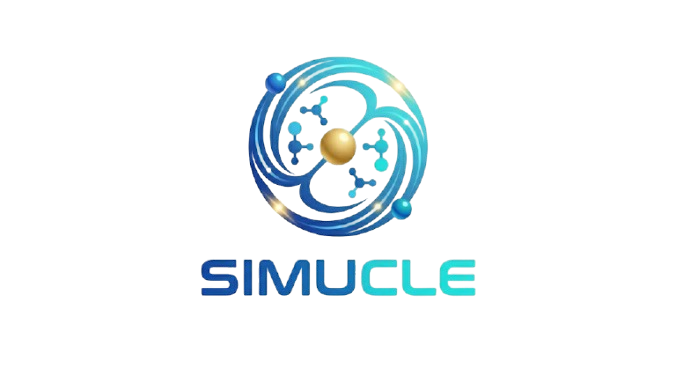

# SIMUCLE



**SIMUCLE** — A desktop **nuclear & molecular simulation toolkit** with a real particle accelerator interface.

Build custom atoms and ions, explore real chemical compounds (powered by live PubChem data), and run fusion experiments in a virtual accelerator. Perfect for learning nuclear physics, chemistry, or just having fun smashing particles together.


## ✨ Features

- **Periodic Table & Custom Atoms** — Create any element (including hypothetical superheavies with systematic IUPAC names)
- **Ion Builder** — Adjust electron count for real ions
- **Real Compound Database** — Search PubChem live for *any* discovered molecule
- **Particle Accelerator Simulator** — Choose projectiles, targets, beam energy, and states of matter
- **Fusion Engine** — Realistic collision outcomes, new element discovery, and reaction logging
- **Visualizations** — 3D plots, shell diagrams, and summary charts
- **Standalone Executable** — Built with PyInstaller (Windows ready)

## 🚀 Quick Start

### Run in terminal

```bash
pip install numpy, matplotlib, json, re, tkinter, dataclasses, typing, urllib, requests
```

### Download .zip file


### Locate dist folder and open *SIMUCLE.exe*

